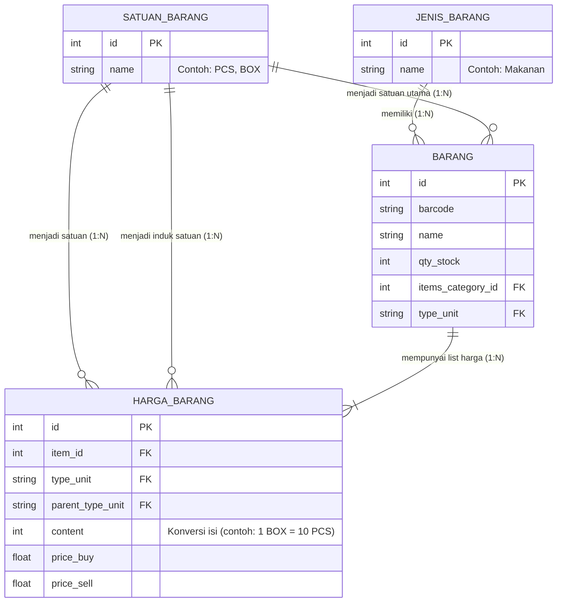

# E-Commerce Svelte + Rust (Tauri Desktop App)

Sistem Kasir & Manajemen E-Commerce berbasis desktop modern yang dibangun menggunakan perpaduan **Svelte 5** (Frontend) dan **Rust / Tauri** (Backend).

## 🚀 Persiapan & Instalasi (Development Setup)

### 1. Prerequisites (Node.js & NVM)
Aplikasi ini membutuhkan Node.js (via NVM direkomendasikan):
```bash
brew install nvm

# Tambahkan direktori NVM ke konfigurasi shell (.zshrc)
mkdir ~/.nvm
echo 'export NVM_DIR="$HOME/.nvm"' >> ~/.zshrc
echo 'source $(brew --prefix nvm)/nvm.sh' >> ~/.zshrc
source ~/.zshrc

# Install Node.js LTS
nvm install --lts

# Verifikasi instalasi
node -v
npm -v
```

### 2. Install Tauri CLI & Jalankan Aplikasi
```bash
npm install --save-dev @tauri-apps/cli
npm run tauri dev
```

---

## 💾 Arsitektur Database (PostgreSQL & SQLx)

Aplikasi ini menggunakan PostgreSQL dengan **SQLx** sebagai *Query Builder* & *Migration System* di sisi Rust.

### Relasi Entitas Master Data (Barang)
Berikut adalah struktur relasi (*Entity Relationship*) untuk modul manajemen persediaan barang:


*Catatan: Konfigurasi harga barang sengaja dipisahkan ke tabel `items_price` (`HARGA_BARANG`) agar sistem mendukung harga bertingkat dan konversi satuan secara dinamis (contoh: bisa mendeteksi penjualan eceran vs karton secara akurat untuk memotong stok `qty_stock`).*

### Panduan Migrasi SQLx
```bash
# Install CLI SQLx (jika belum)
cargo install sqlx-cli --features postgres

# Membuat file migrasi baru
sqlx migrate add nama_file_migrasi

# Menjalankan migrasi ke database (Update)
sqlx migrate run 

# Membatalkan migrasi terakhir (Rollback)
sqlx migrate revert
```

---

## 🛠 Panduan Backend & Custom ORM (Rust)

Aplikasi ini menggunakan sistem ORM fungsional buatan sendiri yang bernama `QueryBuilderPostgrest` untuk menyederhanakan proses CRUD ke PostgreSQL.

### 1. Definisi Model
Setiap tabel harus mendefinisikan implementasi trait `Model`.
```rust
use crate::base::database::postgres::orm::{Model, QueryBuilderPostgrest};

#[derive(Clone, Default, FromRow, Debug)]
struct User {
    pub id: i32,
    pub username: String,
    pub email: String,
    // ... field lainnya
}

impl Model for User {
    const TABLE: &'static str = "users";
    const FIELDS: &'static [&'static str] = &[
        stringify!(username),
        stringify!(email),
        // ... (Pastikan urutan sama dengan saat eksekusi .values() di method Create)
    ];
}
```

### 2. Contoh Penggunaan ORM (CRUD)

**READ (Pagination):**
```rust
let results = QueryBuilderPostgrest::<User>::new()
    .find_by_pagination(1, 10) // Page 1, 10 item
    .await;
```

**READ (All with Where Clause):**
```rust
let results = QueryBuilderPostgrest::<User>::new()
    .where_clause("username='toti'")
    .find_all()
    .await;
```

**READ (First Record):**
```rust
let results = QueryBuilderPostgrest::<User>::new()
    .find_one_first()
    .await;
```

**CREATE (Menggunakan vector values):**
```rust
let create = QueryBuilderPostgrest::<User>::new()
    .values(vec![
        "toti",
        "toti@example.com",
        "password",
        // ... (Nilai harus di-passing secara urut sesuai dengan const FIELDS pada impl Model)
    ])
    .create()
    .await;
```

---

## 💡 Recommended IDE Setup
Agar pengalaman ngoding lebih maksimal, disarankan menggunakan:
- [VS Code](https://code.visualstudio.com/)
- **Ekstensi Wajib**: 
  - [Svelte for VS Code](https://marketplace.visualstudio.com/items?itemName=svelte.svelte-vscode)
  - [Tauri](https://marketplace.visualstudio.com/items?itemName=tauri-apps.tauri-vscode)
  - [rust-analyzer](https://marketplace.visualstudio.com/items?itemName=rust-lang.rust-analyzer)
